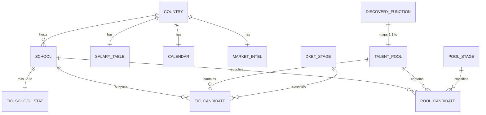
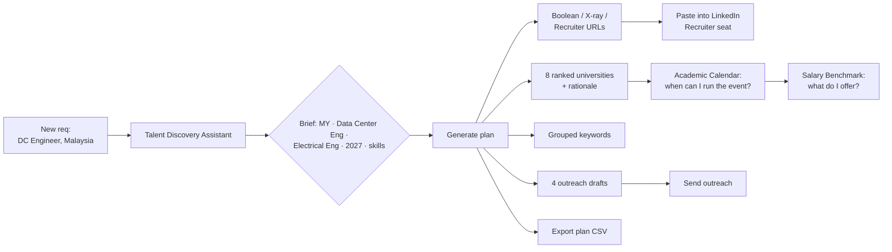

# Product Requirements Document — ASEAN EIP Talent Intelligence Engine

**Document type:** As-built PRD (reverse-engineered from the current implementation)
**Version:** 1.0 · 25 September 2026
**Status:** Prototype / hackathon demo — zero-dependency static web app
**Scope:** `index.html`, `assets/*.js`, `assets/styles.css`, `data/*.js`

> ⚠️ **Superseded — describes the v1.0 information architecture.**
> The application has since been rebuilt as the **ASEAN EIP Talent Intelligence Engine**, organised around the recruiter decision journey *Know the Market → Discover Talent → Take Action*:
> **Section A · Know the Market** (ASEAN Overview, Country Profiles), **Section B · Discover Talent** (Talent Discovery Dashboard, Hidden Talent Search) and **Section C · Take Action** (Recommended Recruiting Actions).
> The v1.0 Section A pages (Top Schools, Salary Benchmark, Academic Calendar) and the old Section B / Section C split no longer exist, and salary figures have been replaced by qualitative Low / Medium / High market bands.
> See `README.md` for the current architecture. The sections below remain useful as background on the data model and design principles, which carried over unchanged.

---

## 1. Product Vision

> **Give an early-careers recruiting team one browser tab that answers three questions: where is the talent, what is it worth, and who in our own pipeline are we already ignoring?**

The ASEAN EIP Talent Intelligence Engine is a self-contained decision-support surface for campus and early-career hiring across six Southeast Asian markets — **Singapore, Malaysia, Indonesia, the Philippines, Thailand and Vietnam**. It combines three layers that normally live in three different systems:

| Layer | Question answered | Section |
|---|---|---|
| **Market knowledge** | Which schools, what salary, when are students free? | A — Knowledge Hub |
| **Lead generation** | Where do I go find this talent and what do I say? | B — Lead Generator |
| **Pipeline intelligence** | Who is already in our pools and stalling? | C — Talent Intelligence |

Design principles observable in the build:

1. **Zero infrastructure.** No build step, no server, no CDN, no package manager. `index.html` opens under `file://`. Mock data ships as JavaScript `const`s rather than `.json` specifically because browsers block `fetch()` of local JSON under `file://`.
2. **Deterministic demo.** All generated rosters use seeded linear-congruential PRNGs, so the same numbers appear on every reload and in every demo.
3. **Never stale.** Dates are stored as **day offsets from today**, not absolute dates, so a demo run in six months still shows "added 3 days ago".
4. **Read-only and privacy-safe.** Nothing is persisted — no `localStorage`, no network calls, no scraping. The only externally actionable artefacts are LinkedIn boolean / X-ray / Recruiter URLs intended for manual paste into a licensed seat.
5. **One shared UI spine.** `assets/app.js` exposes a `window.UI` bridge (helpers + pluggable `UI.exporters` map) so each section is independently droppable.

---

## 2. Business Problem Being Solved

### 2.1 The core problem

Early-career recruiting in ASEAN is **six different markets pretending to be one region**. A recruiter operating regionally faces:

- **Fragmented market knowledge.** QS rank does not tell you whether a school teaches in English, when its students are free for a 12-week internship, or whether it already supplies your pipeline. Thai universities graduate in March; Singaporean ones in July; Vietnamese in May–August. A single regional campaign calendar is structurally wrong.
- **Non-comparable compensation.** Six currencies, six statutory employer-burden regimes (CPF, EPF/SOCSO, BPJS…), and intern stipends quoted monthly while graduate salaries are quoted annually. Benchmarking by hand is error-prone.
- **The "where is this talent?" gap.** A recruiter knows they need a Data Center Engineer in Malaysia. They do *not* know that graduates rarely self-identify as data-centre talent and must be recruited out of power, building-services and facilities programmes. This domain knowledge lives in senior recruiters' heads.
- **Blank-page sourcing cost.** Composing a defensible LinkedIn boolean across 6 schools × 4 degree-name variants × 6 title variants × skills × class-of years is 20–40 minutes of work that gets redone per requisition.
- **Hidden talent / pool siloing — the highest-value problem.** Candidates sit in *one* talent pool owned by *one* recruiter. A qualified Azure engineer sitting in `COM-TSELL` is invisible to the recruiter working `ENG-SWE`. Pipelines therefore "leak" not by rejection but by **neglect** — 213 of 518 candidates in the seeded Section C roster meet at least one neglect condition, and 128 have had no activity for 60+ days.
- **No health signal on a school relationship.** Nobody can say "our NUS relationship is fine but our USM relationship is critically cold" without a manual pull.

### 2.2 Cost of the status quo

| Symptom | Consequence |
|---|---|
| Duplicated market research per requisition | Recruiter hours spent on re-derivable facts |
| Wrong-season campus campaigns | Missed intakes; a full year lost per market |
| Salary offers benchmarked against the wrong market | Offer declines or over-payment |
| Siloed pools | Re-sourcing people the company already knows — the most expensive way to fill a role |
| Stalled candidates | Warm relationships decaying to cold; brand damage on campus |

### 2.3 Why now / why this shape

The product is a **hackathon prototype built to prove the reasoning, not the plumbing**. It deliberately mocks the ATS so the interesting part — the scoring, the funnel logic, the neglect detection — can be demonstrated and argued about before anyone commits to an integration.

---

## 3. Key User Personas

### Persona 1 — "Priya", ASEAN Early-Careers Recruiter *(primary)*
- **Context:** Owns 1–2 talent pools, covers 2–4 markets, carries a req load.
- **Jobs to be done:** Find where to source; build the search string; know what to pay; know who to contact this week.
- **Uses:** Talent Discovery Assistant (daily), Talent Pool Management (daily), Hidden Talent Search (weekly).
- **Success:** "I got a defensible shortlist and four outreach drafts in 90 seconds instead of an afternoon."

### Persona 2 — "Daniel", Talent Pool Owner / Sourcing Lead
- **Context:** Owns a global pool (e.g. `ENG-DC`, 128 candidates) and a team of 4 recruiters.
- **Jobs to be done:** Report pool health; spot stage bottlenecks; distribute work; export rosters.
- **Uses:** Talent Pool Management overview table + stage distribution chart, CSV export.
- **Success:** "I can see 42% of my pool is parked at Sourced and nobody has run the first outreach sequence."

### Persona 3 — "Elaine", Regional TA Manager / Head of Early Careers
- **Context:** Accountable for regional coverage and spend.
- **Jobs to be done:** Which markets are under-covered? Which university relationships have gone cold? Is our warm pipeline growing?
- **Uses:** ASEAN Talent Dashboard, University Attention panel, Salary Benchmark (USD view), Academic Calendar coverage heatmap.
- **Success:** "17 of 33 target schools need action, and I know which three to fix first."

### Persona 4 — "Marcus", Campus Programme / Event Manager
- **Context:** Plans the annual campus calendar and internship intakes.
- **Jobs to be done:** When do I run events? When can students actually intern for 12 weeks?
- **Uses:** Academic Calendar Gantt + 12-week coverage heatmap, `internWindow` / `gradMonth` planning table.

### Persona 5 — Compensation / HR Ops partner *(secondary)*
- **Uses:** Salary Benchmark matrix, cost index, employer statutory on-costs; CSV export into an offer model.

### Persona 6 — Executive / demo audience *(secondary)*
- **Uses:** Section C dashboard as the narrative artefact; deterministic data means the story never changes mid-pitch.

---

## 4. Current Features by Section

Navigation is a single-page app: six `<section class="view">` panels toggled by a sidebar `data-view` router in `assets/app.js`. There is no URL routing or deep linking.

---

### SECTION A — KNOWLEDGE HUB

#### A1. Top Schools

- **Purpose.** A tiered, opinionated target-school map for the six ASEAN markets — replacing a rankings table with a recruiting view.
- **User value.** Answers "which 33 schools should we actually prioritise, and why?" in one screen, with a recruiting note per school that carries the tacit knowledge (e.g. *"Penang semiconductor corridor — best hardware/EE talent in Malaysia"*; *"Mandatory 4-month On-the-Job Training; 3 intakes/year = year-round interns"*).
- **How it works.**
  - Renders 33 `SCHOOLS` records as cards, border-coloured by tier (`TIERS`: T1 Priority blue / T2 Core teal / T3 Reach purple).
  - Four live stat tiles recompute against the filtered set: schools listed, markets, Tier-1 count, QS top-300 count.
  - Filters compose with AND: country multi-select chips, tier dropdown, strength dropdown (derived dynamically from the union of all `strengths`), and a free-text search over `name + abbr + city`.
  - Sort order is fixed: tier → country → name.
  - `⬇ Export CSV` exports **the filtered set** (11 columns) as `asean-top-schools.csv`.
- **Data required.** `SCHOOLS[]`: `country, tier, name, abbr, city, qsWorld (nullable), strengths[], intake, langs[], site, notes`. Plus `COUNTRIES[]` and `TIERS{}`.
- **Current limitations.**
  - Tier assignment is editorial and hard-coded — there is no rubric or override UI.
  - `qsWorld` is `null` for 9 schools (including HUST, HCMUT, FPT, RMIT VN, BINUS, Monash MY, SIT, Mapúa), so QS-based comparisons silently under-represent Vietnam.
  - No cohort-size, fee, alumni-outcome, or contact/relationship-owner fields.
  - Search does not cover `strengths` or `notes`.
  - Filter state is not shareable (no URL params) and not persisted.
  - QS ranks are a point-in-time snapshot with no `asOf` date and no refresh mechanism.

#### A2. Salary Benchmark

- **Purpose.** Like-for-like early-career compensation planning across six markets.
- **User value.** Converts six currencies into one comparable USD view and surfaces the employer on-costs that make a "cheap" market less cheap than it looks.
- **How it works.**
  - Matrix of **6 role families × 4 levels × 6 markets** = 144 ranges. Roles: Software Engineer, Data/ML Engineer, Product Manager, Business/Data Analyst, Sales/GTM, Customer Support/Ops. Levels (`LEVELS`): Intern (monthly stipend), Fresh Grad 0–1 yr, Mid 3–5 yr, Senior 6–9 yr.
  - Each cell is a `[low, high]` P25→P75 range. A horizontal range bar per market shows the band plus a midpoint marker, scaled to the max `high` across markets.
  - A **Local currency / USD** segmented toggle converts via `COUNTRIES[].fxToUSD`. In local mode the chart explicitly warns that values are not comparable.
  - A full matrix table shows all six roles at the selected level, and a side panel shows `costIndex` (SG = 100) and `employerBurden` prose per market.
  - Export emits the **entire** matrix (every country × role × level) with a `monthly`/`annual` basis column — not just the current view.
- **Data required.** `SALARY[cc] = { costIndex, employerBurden, roles: [{ role, intern[], grad[], mid[], senior[] }] }`; `COUNTRIES[].fxToUSD, currency`; `LEVELS[]`.
- **Current limitations.**
  - **FX rates are hard-coded constants** with no `asOf` date and no refresh — the single largest accuracy risk in Section A.
  - Base salary only: no bonus, equity, allowances, 13th-month (material in PH/ID/TH), or sign-on.
  - `employerBurden` is free prose, not a computable percentage, so true cost-to-company cannot be calculated.
  - `costIndex` is unsourced and its basis is undefined (cost of living? cost of labour?).
  - No seniority interpolation, no city-level differentiation (Jakarta vs. Surabaya), no industry split.
  - Ranges are labelled P25→P75 but no sample size, source or confidence is carried.

#### A3. Academic Calendar

- **Purpose.** Put six incompatible academic calendars on a single week-resolution axis.
- **User value.** Directly answers "when can I run an event?", "when can students do a 12-week internship?", and "when are they work-ready?" — the three questions that break regional campus plans.
- **How it works.**
  - A 52-week Gantt, one row per market. Bands are typed (`BAND_STYLE`): teaching term (blue), exams (red), break (grey), internship window (green), graduation (amber).
  - **Year-wrapping bands are split into two segments** (`segments()`), so a break running week 50 → week 2 draws correctly at both ends.
  - A **two-lane collision allocator** (`assignLanes()`) stacks overlapping bands (e.g. a recess week inside a semester) instead of hiding them.
  - A vertical **"today" marker** is computed live from the current date.
  - Hover tooltips give market, band label, type, total weeks, and month/week range.
  - A `Highlight internship windows only` checkbox adds an `intern-focus` class that dims non-internship bands.
  - A planning table lists `system`, `internWindow` and `gradMonth` prose per market.
  - A **12-week internship coverage heatmap**: for each market it derives the set of calendar months touched by any `intern` band, ticks them, and renders a `n/6` coverage row shaded by density.
  - Export emits every band with start/end week and derived start/end month.
- **Data required.** `CALENDAR[cc] = { system, internWindow, gradMonth, bands: [{ label, type, start, end }] }` (weeks 1–52); `BAND_STYLE{}`.
- **Current limitations.**
  - **Weeks are fixed integers with no year anchor.** The README explicitly flags that Ramadan / Eid al-Fitr breaks (ID, MY) and Lunar New Year (VN) move by several weeks annually — the calendar silently drifts and there is no update prompt or `validFor: 2026` field.
  - `weekToMonth` uses a linear 52→12 approximation, not real calendar months, so month boundaries are approximate by design.
  - Only two lanes: a third overlapping band is force-stacked into lane 1 and can visually collide.
  - One calendar per **country**, not per institution — Monash MY (Feb/Jul), FPT (Jan/May/Sep), RMIT VN (Feb/Jun/Oct), DLSU (trimester) and Mapúa (quarter) all deviate from their national row.
  - The heatmap treats a month as "available" if *any* week is inside an internship band — it does not verify a contiguous 12-week run.
  - No public-holiday layer, no export of the heatmap, no multi-year view.

---

### SECTION B — LEAD GENERATOR

#### B1. Talent Discovery Assistant ⭐ *(flagship)*

- **Purpose.** Convert a five-field hiring brief into a complete, defensible sourcing plan.
- **User value.** Collapses the blank-page problem. The recruiter states *what* they need; the assistant answers *where it is, how to search for it, and what to say* — with a stated rationale for every school it recommends. Critically, it uses a signal no rankings table has: **how much of the relevant talent pool each school already supplies.**
- **How it works.**
  - **Interface.** A Fluent-styled assistant conversation: a left "Discovery brief" composer, a right message thread. Running a brief appends a **user turn** (the brief rendered as a natural sentence, e.g. *"I'm hiring Software Engineering talent in Vietnam. I want Computer Science graduates from 2027, strong on Java, Python. Where do I find them?"*) and an **assistant turn**.
  - **Five inputs.** Country (multi-select chips, SG preselected) · Function (10 `DISCOVERY_FUNCTIONS`) · Major (union of `MAJORS` + every function's majors) · Graduation year (free numeric entry, validated to `[thisYear, thisYear+8]`, with a red `bad` class on invalid input) · Skills (multi-select chips seeded from the function's bank, first three preselected, plus free-text "add your own skill" that survives a function switch).
  - **Four presets** ("Software engineers in Vietnam", "Data centre engineers in Malaysia", "Technical support in the Philippines", "Pre-sales across Singapore & Thailand") apply a full brief and auto-run — one-click demo.
  - **Simulated reasoning log.** Six `DISCOVERY_STEPS` tick through with a 160–340 ms delay each, and each completed step is annotated with a **real number** from the computation (e.g. *"6 of 6 schools in market shortlisted"*, *"168 candidates already in the primary pool"*, *"41 keywords across 6 groups"*). The plan is computed **before** the animation so the log never lies.
  - **Four outputs**, each a numbered Fluent card (1 of 4 … 4 of 4) — see §10 for the algorithms: university recommendations, LinkedIn Recruiter search, grouped keywords, outreach drafts.
  - Copy buttons on the boolean, each subject and each body; a "Copy all keywords" action; tabbed outreach panes; real, openable Google X-ray / LinkedIn people / LinkedIn Recruiter URLs.
  - A market-intelligence note for the first selected country is injected into the summary line.
  - `⬇ Export plan` writes a 4-column `talent-discovery-plan.csv` covering brief, recommendations with rationale, all three search strings, keyword groups and all four drafts.
  - A `busy` flag and a disabled Run button prevent concurrent runs; `reveal()` guards `scrollIntoView` for headless runtimes.
- **Data required.** `DISCOVERY_FUNCTIONS[]` (`id, label, pool, family, titles[], majors[], skills[], signals[], note`); `MAJOR_SYNONYMS` + `DISCOVERY_MAJOR_SYNONYMS`; `MARKET_INTEL[cc]`; `OUTREACH_TEMPLATES[]`; `DISCOVERY_STEPS[]`; `SCHOOLS[]`; `TALENT_POOLS[]` and `TALENT_POOL_CANDIDATES[]`.
- **Current limitations.**
  - **Not an LLM and not an API call.** It is a deterministic rules engine wearing a chat UI. Free-text intent is not parsed; the "conversation" is one-shot with no memory, no follow-up questions and no thread persistence.
  - Single major and single graduation year only — no multi-major or year-range brief, despite the code path (`b.years[]`) being written to accept a range.
  - Recommendations are capped at 8 schools and **restricted to the 33 curated `SCHOOLS`** — it cannot discover a school outside the dataset.
  - The discipline-fit test is a bidirectional substring match, so short strength labels can over-match.
  - Skills are used in the boolean and keywords but **do not influence the university score**.
  - No candidate output — it tells you where to look, not who to contact; there is no "push these into a talent pool" action despite every function mapping 1:1 to a pool.
  - Outreach drafts are token-filled templates; `{first name}` is left unfilled deliberately, and `{activity}` is hard-coded to "our next campus session".
  - The plan is not saved, versioned or shareable; refreshing loses it.

#### B2. Talent Pool Management

- **Purpose.** A TA-Hub-style workspace over nine managed global talent pools (992 seeded candidates).
- **User value.** One screen for pool health *and* pool work: headline metrics that provably roll up from the same field the roster shows, a stage-distribution chart with a prescribed next action per stage, and a filterable candidate roster.
- **How it works.**
  - **Pool picker** with per-pool candidate counts, plus an "All talent pools (992 candidates)" option. The overview table doubles as a switcher — clicking a row selects that pool.
  - **Pool meta** shows focus statement, family (Engineering / Commercial), pool owner, recruiter count and pool id.
  - **Five headline metrics** (see §8): Total Candidates, New This Week, Engaged Candidates, Ready for Interview, Hired Candidates — each with a sub-caption stating its definition.
  - **All-pools overview table**: 9 rows × the same five metrics, so a lead can compare pools at a glance.
  - **Seven-stage distribution chart** (`POOL_STAGES`: Sourced → Talent Connection → Engaged → Screen → Interview → Offer → Hired) with count, percentage, stage description and a **prescribed recruiter action** per stage (e.g. *"Clear the screen backlog and release assessment results"*). It recomputes against the **filtered** set, not the whole pool.
  - **Filters**: country chips, graduation year, skill, stage, plus name search. The **skill dropdown is rebuilt per pool** so it never offers a skill nobody in the visible pool has (preserving the selection if still valid).
  - **Sort**: relevance (default) or last-updated, with the other field as a deterministic tie-breaker.
  - **Candidate cards** show name, country, school, stage badge, a relevance bar (0–100), degree, graduation label (e.g. "May 2027"), recruiter owner, pool, skill tags, diversity tags, candidate id, relative added/updated dates (with absolute dates on hover) and source channel.
  - Pagination: 60 per page with an explicit "Show N more / Showing X of Y" control.
  - Export honours the active filters and emits 18 columns including ISO dates resolved from the day offsets.
- **Data required.** `POOL_STAGES[]`, `DIVERSITY_TAGS[]`, `TALENT_POOLS[]` (`id, name, family, focus, owner, size, recruiters[], stageMix[7], countryMix{}, degrees[], skills[]`), generated `TALENT_POOL_CANDIDATES[]`, `NAME_POOLS`, `SCHOOLS`, `COUNTRIES`.
- **Current limitations.**
  - **Entirely read-only.** No stage advance, no note, no assignment, no add-candidate, no bulk action — a recruiter cannot actually *work* the pool here.
  - No candidate detail view; the card is the deepest level.
  - No contact information at all (by design for a mock, but it means no outreach can start from this page).
  - Search matches **name only** — not school, skill, degree or recruiter.
  - Skill filter is single-select and exact-match; stage and year are single-select.
  - `relevance` is opaque to the user: the bar shows a number with no breakdown or tooltip.
  - No trend or time-series — "New This Week" is the only temporal signal; there is no velocity, conversion rate or time-in-stage.
  - Diversity tags are presented but not filterable or reportable.
  - A candidate belongs to exactly one pool; there is no duplicate detection across pools (which is precisely the gap Section C exists to paper over).

---

### SECTION C — TALENT INTELLIGENCE

A single Fluent dashboard of three stacked blocks, answering: *which qualified people are already in our pools and nobody is working?* 518 seeded candidates across all 33 schools, using a **DKET** funnel: **Discover → Know → Engage → Trust**.

#### C1. ASEAN Talent Dashboard

- **Purpose.** Regional coverage and pipeline-health read in one view.
- **User value.** Converts a 518-row roster into six market verdicts, a ranked list of at-risk university relationships, and a shortlist of people to contact this week.
- **How it works.** Four components:
  1. **Six global stat tiles** — candidates across pools (518), target schools tracked (33), Trust stage, requiring engagement (213), inactive 60+ days (128), talent pools searched (9).
  2. **Per-market cards** (`TIC_COUNTRY_STATS`) — target schools, total candidates, Trust count, requires-engagement count, a warm-pipeline bar (`engageRate` = Engage + Trust as % of the market), and a Trust rate. Card tone is risk-coloured: red if >50% of the market needs engagement, amber >35%, otherwise green.
  3. **University Attention panel** — every school bucketed into *Requiring attention* vs *Strong pipeline* with a **Healthy / Needs Attention / Critical Gap** status, showing candidates, Trust, warm %, needs-action count. Each row has a **"Search pool"** button that writes the school into the Hidden Talent Search and scrolls to the results — the one cross-component action in the product.
  4. **Engagement Recommendation panel** — three tabs with live counts: *Requires engagement* (213), *Inactive 60+ days* (128), *Matches hiring demand* (267). Each shows the top 12 by days-since-activity with a human-readable reason (e.g. *"Never contacted since discovery"*, *"No activity for 87 days"*, *"Matches live hiring demand"*).
- **Data required.** `TIC_CANDIDATES[]`, `TIC_COUNTRY_STATS[]`, `TIC_SCHOOL_STATS[]`, `TIC_ENGAGEMENT{}`, `DKET_STAGES[]`, `TIC_POOLS[]`, `TIC_DEMAND{}`, `SCHOOLS`, `COUNTRIES`.
- **Current limitations.** All roll-ups are computed **once at page load** and are static thereafter — filtering the search does not re-scope the dashboard. Engagement lists are capped at 12 with no paging or export of the list itself. Thresholds (50/35%, 18/34%, 42%, 60 days) are hard-coded magic numbers with no configuration. There is no time dimension: no "improved since last month", no trend arrows.

#### C2. Hidden Talent Search

- **Purpose.** Search across **every** talent pool, not just the one you own.
- **User value.** This is the product's headline claim: a recruiter can find a qualified candidate sitting unworked in a colleague's pool, instead of re-sourcing them from scratch.
- **How it works.** Five filters — Title (free text + `datalist` autocomplete), School (dropdown of all 33), Graduation year, Skills (comma-separated free text), Country — plus an **"Only candidates requiring engagement"** checkbox. Search / Reset buttons; Enter submits from the text fields; dropdowns auto-search on change. A filter summary line reports the active criteria in prose, or states that all 9 pools are being shown unfiltered.
- **Data required.** `TIC_CANDIDATES[]` plus `SCHOOLS`/`COUNTRIES` for the option lists.
- **Current limitations.** No saved searches, no search history, no URL-shareable query, no OR/NOT logic (skills are AND-ed), no relevance ranking of results, no fuzzy matching or typo tolerance. Title is substring-only; school is exact-match on the full name. No pool filter, no stage filter, no days-in-stage filter in the search form itself.

#### C3. Search Results

- **Purpose.** Actionable, sortable output.
- **User value.** Surfaces DKET stage and days-in-stage side by side, so stalled records are visually obvious.
- **How it works.** A table of candidate (with title, country flag and a `demand` tag where applicable), school (abbr + full name), graduation year, skill tags, current talent pool, DKET stage badge and days in stage. Three sortable columns (graduation year, DKET stage — ordered Discover→Trust — and days in stage, which defaults to descending), with name as a stable tie-breaker. Rows meeting the neglect test get a `flagged` class; days in stage > 60 renders `stale`. 40 rows per page with a "Show N more of Y" control, a live count pill and a DKET colour legend. Export emits 12 columns in current sort order, including derived `Matches demand` and `Needs engagement` booleans.
- **Current limitations.** No row-level action (no "claim", "assign to me", "add to my pool", "start outreach") — the user must leave the product to act. No candidate detail view. No column chooser, no multi-column sort, no select-all/bulk export of a subset. The export is the only egress.

---

## 5. Data Model

### 5.1 Overview



### 5.2 Entities

**`COUNTRIES[]` — 6 records** (`data/data.js`)

| Field | Type | Notes |
|---|---|---|
| `code` | `SG\|MY\|ID\|PH\|TH\|VN` | Primary key, used everywhere |
| `name`, `flag`, `currency`, `hub` | string | `hub` = primary recruiting city |
| `fxToUSD` | number | Hard-coded, undated |

**`SCHOOLS[]` — 33 records**

| Field | Type | Notes |
|---|---|---|
| `country` | FK → COUNTRIES | |
| `tier` | 1 \| 2 \| 3 | Editorial priority |
| `name`, `abbr`, `city`, `site` | string | `abbr` is the join key used by Section C |
| `qsWorld` | number \| null | Null for 9 schools |
| `strengths[]` | string[] | Free-text discipline labels; drives discovery fit |
| `intake` | string | e.g. `"Jan / May / Sep"` |
| `langs[]` | `EN\|MS\|ID\|TH\|VN\|FIL` | Teaching language |
| `notes` | string | Tacit recruiting knowledge |

**`SALARY[cc]`** → `{ costIndex, employerBurden, roles[6] }`; each role → `{ role, intern[2], grad[2], mid[2], senior[2] }`. Intern is a **monthly** figure; all others annual. **144 ranges total.**

**`CALENDAR[cc]`** → `{ system, internWindow, gradMonth, bands[] }`; band → `{ label, type: term|exam|break|intern|grad, start: 1..52, end: 1..52 }` where `end < start` denotes a year-wrap.

**`TALENT_POOLS[]` — 9 records** — `{ id, name, family: Engineering|Commercial, focus, owner, size, recruiters[], stageMix[7], countryMix{cc:weight}, degrees[], skills[] }`. Sizes: ENG-SWE 168, ENG-DC 128, COM-TSUP 120, COM-SALES 112, ENG-OPS 104, ENG-SPEC 96, COM-CS 92, COM-TSELL 88, COM-CONS 84 = **992**.

**`POOL_STAGES[]` — 7 records** — `{ id, label, desc, action, colour }`, ordered Sourced(0) → Hired(6).

**`TALENT_POOL_CANDIDATES[]` — 992 generated records**

| Field | Type | Notes |
|---|---|---|
| `id` | string | `"ENG-SWE-0042"` |
| `pool` | FK → TALENT_POOLS | Exactly one |
| `name`, `country`, `school`, `schoolAbbr`, `tier` | | Name built from same-tradition given/family groups, honouring `order: family-first` |
| `degree`, `degreeLevel`, `degreeField` | | Level drawn 4×Bachelor / 1×Master / 1×PhD |
| `gradYear`, `gradMonth`, `gradLabel` | | Year weighted 28/46/26 across Y, Y+1, Y+2; month drawn from market-specific `GRAD_MONTHS` |
| `skills[]` | 3–6 from pool bank | |
| `diversity[]` | 1–2 tags, 52% of records | |
| `recruiter` | from `pool.recruiters` | |
| `stage`, `stageIndex` | FK → POOL_STAGES | Weighted by `pool.stageMix` |
| `added`, `updated` | **negative day offsets** | Later-stage candidates added longer ago |
| `relevance` | 31–99 | Computed; see §9 |
| `source` | enum of 9 channels | Campus fair, Hackathon, Referral, Silver medalist… |

**`DKET_STAGES[]` — 4 records** — `{ id, label, colour, desc }`: Discover (grey) → Know (blue) → Engage (amber) → Trust (green).

**`TIC_CANDIDATES[]` — 518 generated records** (generated **per school**, not per pool)

| Field | Notes |
|---|---|
| `id` | `"TIC-1000"`+ |
| `name` | From per-country `TIC_NAMES` banks |
| `title` | From `TIC_TITLES[family]` |
| `country, school, schoolAbbr, schoolTier, city` | Inherited from the generating school |
| `gradYear` | Y, Y, Y+1, Y+1, Y+2 |
| `skills[]` | 3–4 from `TIC_SKILLS[family]` |
| `pool`, `poolId`, `family` | Randomly assigned across all 9 pools |
| `stage` | DKET, quota-allocated by school profile |
| `daysInStage` | 3–57 normal, 62–211 stalled |
| `lastActivityDays` | ≤ `daysInStage`; 1–58 normal, 55–174 stalled |
| `demandMatch` | boolean; any skill ∈ `TIC_DEMAND[family]` |

**Derived, computed once at load:** `TIC_COUNTRY_STATS[6]`, `TIC_SCHOOL_STATS[33]` (sorted ascending by warm rate), `TIC_ENGAGEMENT{ needsEngagement: 213, inactive60: 128, demandMatch: 267 }`.

**Reference data:** `TIERS`, `LEVELS`, `BAND_STYLE`, `MAJORS[14]`, `MAJOR_SYNONYMS`, `DISCOVERY_MAJOR_SYNONYMS`, `NAME_POOLS`, `TIC_NAMES`, `DIVERSITY_TAGS[9]`, `DISCOVERY_FUNCTIONS[10]`, `MARKET_INTEL[6]`, `OUTREACH_TEMPLATES[4]`, `DISCOVERY_STEPS[6]`, `TIC_TITLES`, `TIC_SKILLS`, `TIC_DEMAND`, `TIC_SCHOOL_PROFILE`.

### 5.3 Model observations

- **Two parallel candidate models exist and never reconcile.** `TALENT_POOL_CANDIDATES` (992, 7-stage `POOL_STAGES`, day-offset dates, relevance score) and `TIC_CANDIDATES` (518, 4-stage DKET, integer day counters, demand flag) are generated independently from different seeds. A person in one does not exist in the other. This is the single most significant modelling debt.
- **The join key differs by section:** Section B joins candidates to schools on `school` (full name); Section C joins on `schoolAbbr`.
- **`DISCOVERY_FUNCTIONS.pool` is a real 1:1 foreign key to `TALENT_POOLS.id`** — the integration point for a future "add to pool" action already exists in the data but is unused in the UI.
- **No PII, no contact fields, no identity.** There is no email, phone, LinkedIn URL or consent/GDPR field anywhere — appropriate for a mock, blocking for production.
- `TIC_POOLS` gracefully degrades to a hard-coded nine-pool list if `data/talentpool.js` is absent, so Section C can ship standalone.

---

## 6. User Journey

### 6.1 Journey A — "I have a new requisition" (Priya, primary flow)



**Step-by-step.** Open the hub → Talent Discovery Assistant → pick Malaysia → choose *Data Center Engineering* (majors auto-switch to Electrical Engineering; skill bank swaps to Power Distribution / HVAC / AutoCAD, first three preselected) → type graduation year 2027 → add any custom skill → **Generate discovery plan**. The brief is echoed as a sentence, the run log ticks through six steps with live counts, and four cards appear. The recruiter copies the boolean into Recruiter, cross-checks the intake month on the **Academic Calendar**, checks the fresh-grad band on **Salary Benchmark** (USD toggle for the regional comparison, local for the offer), and copies an InMail draft. Optionally exports the whole plan as CSV.

### 6.2 Journey B — "Before I source externally, what do we already have?" (highest-value flow)

Talent Intelligence → read the **ASEAN Talent Dashboard** → spot that Malaysia shows a high requires-engagement count → open **University Attention → Requiring attention** → see USM flagged *Critical Gap* → click **Search pool** (auto-fills the school and scrolls to results) → add `Power Systems` to Skills and tick *Only candidates requiring engagement* → sort by **Days in stage** descending → work the flagged rows → export the shortlist as CSV.

### 6.3 Journey C — "How healthy is my pool?" (Daniel, pool owner)

Talent Pool Management → select *Engineering - Data Centers - Global* → read the five headline metrics → scan the all-pools table to compare against peers → read the stage distribution and notice 42% parked at Sourced with the prescribed action *"Run the first outreach sequence"* → filter to Malaysia + graduating 2027 + stage Sourced → sort by relevance → export the filtered roster and hand it to a recruiter.

### 6.4 Journey D — "Plan next year's campus calendar" (Marcus / Elaine)

Top Schools → filter Tier 1 + Computer Science → note per-market coverage → Academic Calendar → read the Gantt for exam blackouts → open the 12-week coverage heatmap to find months with 4–6 markets available → export the calendar CSV into the programme plan → Salary Benchmark for budget sign-off.

### 6.5 Friction points in the current journeys

- Every journey **ends at an export or a copy-to-clipboard**. There is no write-back, so the loop closes outside the product.
- Sections B and C do not share a candidate identity, so a discovery plan cannot be checked against the hidden-talent roster.
- Only one cross-section action exists (University Attention → Hidden Talent Search). Everything else requires manual re-entry.
- No state is preserved between sections or across reloads.

---

## 7. Functional Requirements

### 7.1 Global / platform

| ID | Requirement | Status |
|---|---|---|
| FR-G01 | The application MUST run from `index.html` with no build step, server, CDN or package install | ✅ Implemented |
| FR-G02 | The application MUST function under the `file://` protocol | ✅ (data shipped as JS `const`s, not JSON) |
| FR-G03 | The application MUST NOT make external network calls | ✅ |
| FR-G04 | The application MUST NOT persist any data (`localStorage`, cookies, server) | ✅ Read-only by design |
| FR-G05 | Sidebar navigation MUST switch between the six views without reload | ✅ `data-view` router |
| FR-G06 | Generated mock data MUST be identical on every reload | ✅ Seeded LCG PRNGs |
| FR-G07 | Relative dates MUST remain accurate over time | ✅ Day offsets from `today` |
| FR-G08 | All user-facing dynamic text MUST be HTML-escaped | ✅ `esc()` applied throughout |
| FR-G09 | Every section MUST offer a CSV export | ✅ `UI.exporters` registry + `data-export` delegation |
| FR-G10 | CSV export MUST be Excel-safe (BOM, quote escaping, CRLF) | ✅ |
| FR-G11 | Transient feedback MUST use a non-blocking toast (2.2 s) | ✅ |
| FR-G12 | A persistent disclaimer MUST state benchmarks are indicative | ✅ Sidebar footer |
| FR-G13 | Deep linking / shareable view URLs | ❌ Not implemented |
| FR-G14 | Accessibility (keyboard nav, ARIA, focus management) | ⚠️ Partial — semantic HTML only, no ARIA roles on tabs/chips |
| FR-G15 | Mobile / responsive layout | ⚠️ Desktop-first; wide tables scroll |

### 7.2 Top Schools

| ID | Requirement | Status |
|---|---|---|
| FR-A101 | Display all 33 target schools as tier-coloured cards | ✅ |
| FR-A102 | Show QS rank, intake month, teaching language, website and recruiting note per school | ✅ |
| FR-A103 | Filter by country (multi), tier, strength and free text, combined with AND | ✅ |
| FR-A104 | Populate the strength list dynamically from the dataset | ✅ |
| FR-A105 | Recompute the four stat tiles against the filtered set | ✅ |
| FR-A106 | Sort by tier → country → name | ✅ |
| FR-A107 | Show an empty state when no school matches | ✅ |
| FR-A108 | Export the **filtered** set | ✅ |
| FR-A109 | Search MUST cover strengths and notes | ❌ |
| FR-A110 | Edit / add / tier-override a school | ❌ |

### 7.3 Salary Benchmark

| ID | Requirement | Status |
|---|---|---|
| FR-A201 | Provide ranges for 6 roles × 4 levels × 6 markets | ✅ |
| FR-A202 | Treat intern figures as monthly stipends and label the basis | ✅ |
| FR-A203 | Toggle local currency ↔ USD | ✅ |
| FR-A204 | Warn that local-currency values are not cross-comparable | ✅ |
| FR-A205 | Render a P25→P75 range bar with a midpoint marker, scaled to the max | ✅ |
| FR-A206 | Show the full role matrix at the selected level | ✅ |
| FR-A207 | Show cost index and employer statutory on-costs per market | ✅ |
| FR-A208 | Export the complete matrix with a monthly/annual basis column | ✅ |
| FR-A209 | FX rates MUST carry an `asOf` date / refresh path | ❌ |
| FR-A210 | Model total cost-to-company from a computable burden rate | ❌ |
| FR-A211 | Include bonus, equity, allowances and 13th-month | ❌ |

### 7.4 Academic Calendar

| ID | Requirement | Status |
|---|---|---|
| FR-A301 | Render a 52-week Gantt for all six markets on one axis | ✅ |
| FR-A302 | Colour-code five band types with a legend | ✅ |
| FR-A303 | Correctly draw year-wrapping bands as two segments | ✅ |
| FR-A304 | Stack overlapping bands without occlusion | ⚠️ Two lanes only |
| FR-A305 | Mark the current week | ✅ |
| FR-A306 | Provide hover detail with total weeks and month range | ✅ |
| FR-A307 | Offer an internship-window focus mode | ✅ |
| FR-A308 | Show per-market calendar system, internship window and graduation prose | ✅ |
| FR-A309 | Render a 12-month × 6-market internship coverage heatmap with an `n/6` summary row | ✅ |
| FR-A310 | Export all bands with derived months | ✅ |
| FR-A311 | Calendars MUST carry a validity year and flag moveable feasts (Ramadan, Tết) | ❌ |
| FR-A312 | Support institution-level calendars that deviate from the national row | ❌ |

### 7.5 Talent Discovery Assistant

| ID | Requirement | Status |
|---|---|---|
| FR-B101 | Accept a five-field brief: country(multi), function, major, graduation year, skills(multi) | ✅ |
| FR-B102 | Validate that ≥1 country is selected | ✅ Toast on failure |
| FR-B103 | Accept free-entry graduation year, 4 digits, within `[thisYear, thisYear+8]` | ✅ Inline `bad` styling + toast |
| FR-B104 | Swap the major default and skill bank when the function changes | ✅ |
| FR-B105 | Allow free-text custom skills that survive a function switch | ✅ Held in `customSkills` |
| FR-B106 | Offer one-click presets that auto-run | ✅ 4 presets |
| FR-B107 | Echo the brief as a natural-language user turn | ✅ |
| FR-B108 | Show a stepwise run log annotated with real computed figures | ✅ 6 steps |
| FR-B109 | Return up to 8 ranked universities with a 0–99 fit score and explicit reasons | ✅ |
| FR-B110 | Return a LinkedIn boolean, a Google X-ray query and openable people/Recruiter URLs | ✅ |
| FR-B111 | Exclude recruiters from the boolean via a NOT clause | ✅ |
| FR-B112 | Return keywords grouped by the field they belong in | ✅ 6 groups |
| FR-B113 | Return four token-filled outreach drafts across the funnel, tabbed | ✅ |
| FR-B114 | Provide copy-to-clipboard for the boolean, keywords, subjects and bodies | ✅ |
| FR-B115 | Prevent concurrent runs | ✅ `busy` flag |
| FR-B116 | Export the complete plan as CSV | ✅ |
| FR-B117 | State clearly that no external API is called | ✅ Disclaimer in-thread |
| FR-B118 | Warn against scraping LinkedIn | ✅ Disclaimer on the search card |
| FR-B119 | Accept a graduation-year **range** and multiple majors | ❌ Single value only |
| FR-B120 | Push shortlisted schools/candidates into the mapped talent pool | ❌ FK exists, action does not |
| FR-B121 | Parse free-text natural-language intent | ❌ Not an LLM |
| FR-B122 | Persist or share a generated plan | ❌ |

### 7.6 Talent Pool Management

| ID | Requirement | Status |
|---|---|---|
| FR-B201 | Provide a pool picker over 9 pools plus an all-pools option, with counts | ✅ |
| FR-B202 | Show pool focus, family, owner, recruiter count and id | ✅ |
| FR-B203 | Show 5 headline metrics with their definitions | ✅ |
| FR-B204 | Derive every headline metric from the candidate's single `stage` field | ✅ Guarantees no drift |
| FR-B205 | Provide an all-pools comparison table that doubles as a switcher | ✅ |
| FR-B206 | Render a 7-stage distribution with count, %, description and prescribed action | ✅ |
| FR-B207 | Recompute the distribution against the filtered set | ✅ |
| FR-B208 | Filter by country(multi), graduation year, skill, stage and name search | ✅ |
| FR-B209 | Scope the skill list to the selected pool, preserving a still-valid selection | ✅ |
| FR-B210 | Sort by relevance or last updated with a deterministic tie-break | ✅ |
| FR-B211 | Render candidate cards with school, degree, graduation, skills, diversity tags, owner, stage, relevance, source and relative dates | ✅ |
| FR-B212 | Paginate at 60 with an explicit "show more" and a count | ✅ |
| FR-B213 | Export the filtered roster with resolved ISO dates | ✅ |
| FR-B214 | Advance stage / add note / assign owner / add candidate | ❌ Read-only |
| FR-B215 | Candidate detail view | ❌ |
| FR-B216 | Search across school, skill, degree and recruiter | ❌ Name only |
| FR-B217 | Explain the relevance score to the user | ❌ |

### 7.7 Talent Intelligence

| ID | Requirement | Status |
|---|---|---|
| FR-C101 | Show 6 global stat tiles covering roster size, coverage, Trust and neglect | ✅ |
| FR-C102 | Show a per-market card with target schools, total, Trust, needs-engagement, warm bar and rates | ✅ |
| FR-C103 | Risk-colour each market card by needs-engagement ratio | ✅ 50% / 35% thresholds |
| FR-C104 | Bucket all 33 schools into attention vs strong, with a 3-level health status | ✅ |
| FR-C105 | Provide a one-click jump from a school row into the cross-pool search | ✅ |
| FR-C106 | Provide three engagement buckets with live counts and a plain-English reason per candidate | ✅ |
| FR-C107 | Rank engagement recommendations by days since last activity | ✅ Top 12 |
| FR-C108 | Search **all** pools on title, school, graduation year, skills and country | ✅ |
| FR-C109 | Offer a "requires engagement only" toggle | ✅ |
| FR-C110 | Summarise the active filters in prose | ✅ |
| FR-C111 | Reset all filters and sort | ✅ |
| FR-C112 | Render results with DKET stage, current pool and days in stage | ✅ |
| FR-C113 | Sort by DKET stage, days in stage and graduation year | ✅ |
| FR-C114 | Visually flag rows needing action and stale day counts | ✅ |
| FR-C115 | Tag candidates matching live hiring demand | ✅ |
| FR-C116 | Paginate at 40 with a live count and DKET legend | ✅ |
| FR-C117 | Export results with derived demand/needs-engagement flags | ✅ |
| FR-C118 | Act on a result row (claim / assign / start outreach) | ❌ |
| FR-C119 | Re-scope the dashboard to the current search | ❌ Static at load |
| FR-C120 | Configure the neglect thresholds | ❌ Hard-coded |
| FR-C121 | Reconcile Section C candidates with Section B pool candidates | ❌ Separate datasets |

---

## 8. Dashboard Logic

### 8.1 Talent Pool Management metrics (Section B)

All five headline metrics derive from **one field** — `stage` / `stageIndex` — which is the explicit design guarantee that the metrics can never drift from the roster below them.

| Metric | Rule | Rationale |
|---|---|---|
| **Total candidates** | `list.length` | Scope = selected pool, or all 992 |
| **New this week** | `added >= -7` | `added` is a negative day offset, so ≥ −7 means within the last 7 days |
| **Engaged candidates** | `stageIndex >= 2` | Engaged, Screen, Interview, Offer, Hired — "Engaged or beyond" |
| **Ready for interview** | `stage ∈ {screen, interview}` | The interview-capacity planning number |
| **Hired candidates** | `stage === "hired"` | Terminal state |

Percentages use `Math.round((part / whole) * 100)` with a zero-guard.

**Stage distribution chart.** For each of the 7 `POOL_STAGES` in order: count, percentage of the filtered total, the stage description, a colour-coded bar, and the prescribed recruiter action. Because it runs on `filtered()` rather than the raw pool, applying a country filter re-shapes the funnel — which is the intended analytical behaviour.

**All-pools overview.** The same `metrics()` function applied to each of the nine pools, giving a directly comparable 9 × 5 grid. The current pool is highlighted with an `on` class.

### 8.2 ASEAN Talent Dashboard (Section C)

**Global tiles:** roster size (518), schools tracked (33), Trust count, `TIC_ENGAGEMENT.needsEngagement.length` (213), `inactive60.length` (128), pools searched (9).

**Per-market card (`TIC_COUNTRY_STATS`)** — computed once at load for each country:

```
total           = candidates where country === cc
trust           = total where stage === "Trust"
needsEngagement = total where ticNeedsEngagement(c)
targetSchools   = SCHOOLS where country === cc
trustRate       = round(trust / total × 100)
engageRate      = round((Engage + Trust) / total × 100)   // "warm pipeline"
risk            = needsEngagement / max(total, 1)
tone            = risk > 0.50 → bad  (red)
                  risk > 0.35 → warn (amber)
                  else        → ok   (green)
```

**University health status (`TIC_SCHOOL_STATS`)** — per school:

```
warm      = Engage + Trust
warmRate  = warm / total
stale     = candidates with lastActivityDays > 60
staleRate = stale / total

status = "Critical Gap"    if warmRate < 0.18 OR trust === 0
       = "Needs Attention" if warmRate < 0.34 OR staleRate > 0.42
       = "Healthy"         otherwise
```

Results are sorted **ascending by `warmRate`**, so the worst relationship is always the first row of the *Requiring attention* tab. The *Strong pipeline* tab re-sorts descending. Current output: **17 of 33 schools require action.**

**Why a school lands where it does.** Each school is seeded with a pipeline "personality" (`TIC_SCHOOL_PROFILE`) that determines its DKET weights, cohort size and staleness odds:

| Profile | DKET weights (D/K/E/T) | Cohort | Stale odds |
|---|---|---|---|
| `strong` | 22 / 26 / 28 / 24 | 16–26 | 0.18 |
| `average` | 38 / 28 / 21 / 13 | 11–20 | 0.32 |
| `weak` | 58 / 26 / 12 / 4 | 6–14 | 0.52 |

Stages are allocated by **exact quota with largest-remainder rounding and a shuffle**, not by independent draws — a deliberate correction, because independent draws let small cohorts drift far enough from the intended mix to make a "strong" school look broken. Warm candidates (Engage/Trust) also get their stale odds multiplied by 0.45, on the reasoning that worked candidates go quiet less often.

**Engagement Recommendation panel.** Three precomputed buckets, each tab showing the top 12 sorted by `lastActivityDays` descending:

| Bucket | Rule | Count |
|---|---|---|
| Requires engagement | `ticNeedsEngagement(c)` | 213 |
| Inactive 60+ days | `lastActivityDays > 60` | 128 |
| Matches hiring demand | `demandMatch && stage !== "Trust"` | 267 |

**Limitation.** All Section C roll-ups are computed **once at module load** and never recomputed. The dashboard is a fixed regional snapshot; only the search results below it are reactive.

---

## 9. Search Logic

### 9.1 Top Schools (Section A)

Pure client-side AND-composition over 33 records: country ∈ selected chips, exact tier, `strengths.includes(major)`, and a case-insensitive substring match on the concatenation `name + abbr + city`. Re-renders on every keystroke (no debounce — acceptable at n = 33).

### 9.2 Talent Pool roster (Section B)

```
country  : multi-select, OR within the group, AND with everything else
gradYear : exact string match
skill    : exact membership in skills[]   (single-select)
stage    : exact match on stage id
name     : case-insensitive substring, name field ONLY
```

Then sorted by `relevance DESC, updated DESC` or `updated DESC, relevance DESC`. Both orderings are total, so pagination is stable.

**Relevance score (clamped to 31–99)** — the ranking signal, computed once at generation:

| Component | Points |
|---|---|
| Base | 22 |
| School tier | T1 = 26, T2 = 18, T3 = 11 |
| Skill depth | `skills.length × 4` (12–24) |
| Funnel progress | `stageIndex × 5` (0–30) |
| Recency of update | ≤14 d = 14, ≤45 d = 8, ≤90 d = 3, else 0 |
| Degree level | PhD = 8, Master = 5, Bachelor = 2 |
| Jitter | −6 … +8 |

The stated intent is to encode "the same things a recruiter eyeballs when ranking a pool by hand". Note it is **static** — it does not respond to the active query, so it is a *quality* score, not a *relevance-to-search* score.

### 9.3 Hidden Talent Search (Section C) — the cross-pool search

```js
TIC_CANDIDATES.filter(c =>
  (!title   || c.title.toLowerCase().includes(title)) &&       // substring
  (!school  || c.school === school) &&                         // exact, full name
  (!year    || String(c.gradYear) === year) &&                 // exact
  (!country || c.country === country) &&                       // exact
  (!skills.length || skills.every(want =>                      // AND across terms
      c.skills.some(s => s.toLowerCase().includes(want)))) &&  // substring within term
  (!onlyNeed || ticNeedsEngagement(c))
)
```

Key characteristics:

- **Scope is every pool.** This is the defining behaviour — the filter never restricts by `poolId`, so a recruiter sees candidates owned by colleagues. It directly attacks the pool-siloing problem in §2.
- **Skills are AND-ed across terms, OR-ed within a term by substring.** `"Azure, SQL"` requires both; `"SQL"` also matches `"SQL Server"`.
- **Title is substring; school is exact.** Title autocompletes from the distinct titles present in the roster; school comes from the canonical 33.
- **No relevance ranking.** Results are ordered purely by the chosen sort column, defaulting to DKET stage ascending (Discover first) — an intentional bias toward the neglected end of the funnel.
- **Filter summary is echoed in prose** so the user can see exactly what was applied, or is told explicitly that all 9 pools are unfiltered.
- **Result sorting** uses `STAGE_ORDER = { Discover:0, Know:1, Engage:2, Trust:3 }`; `days` defaults to descending on first click (most-stalled first); ties break on name for stability.
- **Pagination** is progressive disclosure at 40 rows, preserving sort and filter.

**Gaps.** No OR/NOT operators, no phrase or fuzzy matching, no saved/shared searches, no search over degree, recruiter, source, pool or days-in-stage, and no scoring of how *well* a candidate matches.

---

## 10. Talent Intelligence Logic

This section documents the reasoning engines that constitute the product's actual intellectual property.

### 10.1 Engine 1 — University recommendation scoring (Discovery Assistant)

**Input:** the brief (countries, function, major, skills). **Output:** up to 8 ranked schools with a 0–99 fit score and an explicit reason list.

**Step 1 — Establish pool supply.** Take the talent pool mapped to the selected function (`DISCOVERY_FUNCTIONS.pool`, a real 1:1 FK). For every candidate in that pool, tally `supply[school]` and `warm[school]` (`stageIndex >= 1`, i.e. past Sourced). This is the differentiating signal: *how much of this exact pool does each school already supply?*

**Step 2 — Expand the major.** `synonyms(major)` merges `MAJOR_SYNONYMS` with `DISCOVERY_MAJOR_SYNONYMS` (original never overridden), turning e.g. "Computer Science" into `[Computer Science, Computing, Computer Studies, Informatics, Computing Science]`.

**Step 3 — Score each in-market school.**

| Component | Points | Rule |
|---|---|---|
| **Discipline fit** | 0 or 27–34 | `min(34, 20 + hits × 7)` where a hit is a bidirectional substring overlap between a listed `strength` and any major variant |
| **Tier** | 26 / 18 / 10 | T1 / T2 / T3 |
| **Existing pool supply** | 0–22 | `round(supply[school] / maxSupply × 22)` |
| **QS band** | 10 / 6 / 3 / 2 | ≤100 / ≤500 / ranked / unranked |
| **English instruction** | 6 | `langs` includes `EN` |
| **Total** | `min(99, Σ)` | |

**Step 4 — Generate the rationale.** Each scoring component that fires appends a human-readable reason: *"Recognised strength in Computer Science and Engineering"*, *"Tier 1 target school"*, *"Already supplies 14 candidates to this pool, 9 past Sourced"* or *"No coverage in this pool yet — untapped"*, *"English-taught"*.

**Step 5 — Prune noise, keep signal.** Sort by score descending, then drop schools with **zero discipline overlap** — *unless* fewer than four schools in the market have any overlap at all, in which case the non-fitting ones are retained so a small market never returns an empty list. Take the top 8.

**Why this is defensible.** Ranking tables answer "which school is best?"; this engine answers "which school is best *for this function, in this market, given what our pipeline already proves*". The `supply`/`warm` term is the only component that could not be reproduced from public data, and the "untapped" reason is deliberately framed as an opportunity rather than a penalty.

**Limitations.** Skills do not affect the score. Substring matching on short strength labels can over-fire. Historical conversion (did those supplied candidates ever get hired?) is not modelled — supply is treated as a positive signal regardless of outcome. Scores are relative within a run and not comparable across runs.

### 10.2 Engine 2 — Boolean, X-ray and keyword construction

**Boolean** — a five-to-six clause string built from the shortlisted schools (top 6) × major variants × function title variants × selected skills × class-of years, with an exclusion clause:

```
("National University of Singapore" OR "Nanyang Technological University" OR …)
AND ("Computer Science" OR "Computing" OR "Informatics" OR …)
AND ("Software Engineer" OR "Backend Engineer" OR …)
AND ("Python" OR "Azure" OR …)
AND ("Class of 2027" OR "Expected graduation 2027")
NOT ("recruiter" OR "talent acquisition" OR "headhunter")
```

The `NOT` clause is a practical detail: sourcing searches otherwise return the competing recruiters who list the same schools and skills on their own profiles.

**X-ray** — a narrower `site:linkedin.com/in` Google query using the top 4 schools, top 3 major variants and top 3 skills plus a geography clause, URL-encoded into a live `google.com/search` link. Truncation is deliberate: full boolean strings exceed practical Google query limits.

**LinkedIn URLs** — a public people-search URL (`/search/results/people/?keywords=`) and a Recruiter URL (`/talent/search?keywords=`), both properly `encodeURIComponent`-escaped. These are the **only genuinely real artefacts the product produces**, and both are accompanied by a "paste into a Recruiter seat — never scrape" disclaimer.

**Keywords** — deliberately **grouped by the input field they belong in** rather than dumped as one list, because a recruiter pastes them into different boxes in Recruiter:

| Group | Source |
|---|---|
| Job titles | `function.titles` |
| Degree names | expanded major synonyms |
| Skills | selected skills, falling back to the function's top 6 |
| Profile signals | `function.signals` — e.g. *GitHub portfolio*, *Capture-the-flag ranking*, *Case-competition placement* |
| Graduation | `Class of {year}`, `Expected graduation` |
| Schools | the shortlisted school names |

### 10.3 Engine 3 — Outreach personalisation

Four templates spanning the funnel — **InMail first touch** (Don't-Know → Know), **event follow-up** (Know → Like, *"send within 48 hours — this is where most pipelines leak"*), **application nudge** (Like → Trust), **referral request** (Trust, *"the cheapest source in the plan"*). Eleven tokens are filled from the run: `{school}` = the top-ranked recommendation, `{recruiter}` = the **owner of the mapped talent pool**, `{pool}` = that pool's name, `{skill}` = the recruiter's own selected skills, `{title}` = the function's primary title, plus `{major}`, `{country}`, `{gradYear}`, `{function}`, `{activity}`. `{first name}` is intentionally left as a placeholder, with an explicit instruction to read the draft in your own voice before sending.

### 10.4 Engine 4 — Neglect detection (the "hidden talent" rule)

The single most important rule in the product:

```js
function ticNeedsEngagement(c) {
  if (c.lastActivityDays > 60) return true;                      // gone quiet
  if ((c.stage === "Discover" || c.stage === "Know")
      && c.daysInStage > 45) return true;                        // stalled early
  if (c.demandMatch && (c.stage === "Discover" || c.stage === "Know")
      && c.daysInStage > 30) return true;                        // stalled AND wanted
  return false;
}
```

Three orthogonal failure modes — **silence**, **early-funnel stall**, and **stalled-while-in-demand** (which fires 15 days earlier, because the cost of neglecting a candidate the business is actively hiring for is higher). Output: 213 of 518 candidates (41%).

**Reason attribution** is priority-ordered so the recruiter gets the most *actionable* framing rather than the first condition that happened to fire:

```
demandMatch && stage !== Trust   → "Matches live hiring demand"
lastActivityDays > 60            → "No activity for N days"
stage === Discover               → "Never contacted since discovery"
otherwise                        → "Stalled N days in {stage}"
```

**Demand matching.** `TIC_DEMAND` holds the skills the business is hiring for *right now*, per family — Engineering: Azure, Kubernetes, Machine Learning, Databricks, Cybersecurity, Terraform, Power Systems; Commercial: Salesforce, Solution Selling, Presales Demo, Dynamics 365, Product Analytics. A candidate with any of these carries a `demand` tag in the results table. 267 candidates match, and the bucket deliberately **excludes Trust-stage candidates** — if they are already warm, they are not neglected.

### 10.5 Two funnels, and why

| | Talent Pool Management | Talent Intelligence |
|---|---|---|
| Model | `POOL_STAGES` — 7 stages | `DKET_STAGES` — 4 stages |
| Stages | Sourced → Talent Connection → Engaged → Screen → Interview → Offer → Hired | Discover → Know → Engage → Trust |
| Nature | **Process** funnel — where in the hiring workflow | **Relationship** funnel — how well we know them |
| Terminal state | Hired | Trust (warm and convertible) |
| Drives | Capacity and throughput metrics | Neglect and relationship-health signals |

The two are conceptually complementary — a process funnel and a relationship funnel — but in the current build they run on **independent datasets** and no candidate exists in both. Unifying them is the highest-priority data-model fix (see §12).

### 10.6 Determinism

Both generators use a **linear congruential PRNG** (`s = (s × 1664525 + 1013904223) >>> 0`). Section B keys the seed off an FNV-1a hash of the pool id; Section C uses a fixed literal seed. Consequences: identical output on every load and in every browser, no network or storage needed, and a demo narrative that cannot break mid-presentation. The trade-off is that the data is decorative — it contains no real signal, and any insight derived from it is an artefact of the generator's parameters.

---

## 11. External Dependencies

### 11.1 Runtime dependencies — **none**

| Category | Status |
|---|---|
| npm / package manager | None — no `package.json`, no `node_modules` |
| Build tooling | None — no bundler, transpiler, minifier or task runner |
| CSS framework | None — `assets/styles.css` is hand-written (~30 KB) |
| JS framework | None — vanilla ES2015+ DOM, IIFE module pattern |
| CDN assets | None |
| Fonts / icon libraries | None — emoji glyphs and an inline SVG data-URI favicon |
| Web server | None required — runs under `file://` |
| Backend / API / database | None |
| Analytics / telemetry | None |
| Authentication | None |

### 11.2 Browser platform APIs relied on

| API | Used for | Failure mode |
|---|---|---|
| `Blob` + `URL.createObjectURL` | CSV export | Export silently fails on very old browsers |
| `navigator.clipboard.writeText` | Copy buttons | Guarded — falls back to a "Copy blocked by the browser" toast |
| `Element.scrollIntoView` | Thread and results scrolling | Guarded by a `typeof` check for headless runtimes |
| `Intl` / `toLocaleDateString` / `toLocaleString` | `en-GB` and `en-US` date and number formatting | Locale-dependent output |
| `Math.imul` | FNV-1a hashing in the pool generator | ES2015+ |
| `async/await`, spread, template literals, arrow functions, `Set`, `flatMap` | Throughout | ES2019+ browser required; no transpilation |
| CSS Grid / Flexbox / custom properties | Layout | Modern browser required |

**Effective baseline:** a current evergreen browser (Chrome/Edge/Firefox/Safari). No IE11 support, no polyfills.

### 11.3 Script load order (a real, undeclared dependency)

`index.html` loads eight scripts in a strict sequence. There are no modules and no imports, so **order is the dependency graph**:

```
data/data.js        → COUNTRIES, TIERS, SCHOOLS, SALARY, LEVELS, CALENDAR,
                      BAND_STYLE, MAJORS, MAJOR_SYNONYMS, NAME_POOLS
data/talentpool.js  → needs SCHOOLS, NAME_POOLS
data/discovery.js   → pure reference data
data/copilot.js     → needs SCHOOLS, COUNTRIES; soft-depends on TALENT_POOLS
assets/app.js       → defines window.UI (MUST run before the three below)
assets/talentpool.js / discovery.js / copilot.js → consume window.UI
```

`data/copilot.js` is the only file that degrades gracefully (`typeof TALENT_POOLS !== "undefined"`). Any other reordering throws at load.

### 11.4 External systems referenced but **not** integrated

| System | Relationship |
|---|---|
| **LinkedIn Recruiter** | Deep links generated (`/talent/search?keywords=`); no API, no OAuth, manual paste only |
| **LinkedIn public search** | `/search/results/people/?keywords=` deep link |
| **Google** | X-ray search deep link (`google.com/search?q=site:linkedin.com/in …`) |
| **ATS / TA Hub** | Modelled and imitated; explicitly stated as mock. No integration |
| **QS World University Rankings** | Values transcribed into `SCHOOLS.qsWorld`; no feed, no `asOf` |
| **FX rates** | Hard-coded in `COUNTRIES.fxToUSD`; no provider |
| **Salary survey providers** | Ranges are indicative planning figures; no provider cited |
| **University calendars** | Transcribed into week bands; no source or refresh |
| **Excel / Google Sheets** | The de-facto downstream system — CSV export is the only egress |

### 11.5 Compliance and policy constraints encoded in the product

- **Anti-scraping stance is explicit and repeated**: the search card, the README and the data headers all state that boolean/X-ray strings are for manual use in a licensed Recruiter seat and that LinkedIn must never be scraped.
- **No real candidate data.** Every name, school attribution, diversity tag and date is invented. Diversity tags are flagged as self-declared in a real system.
- **Benchmarks carry a standing disclaimer** ("indicative planning figures — validate before contractual use") in the sidebar and README.
- **No data leaves the browser**, so there is no transfer, retention or residency question in the current build — a property that will be lost the moment a real ATS is connected.

---

## 12. Future Enhancement Opportunities

Grouped by horizon, with the problem each solves.

### Horizon 1 — Close the loop (highest value, lowest risk)

| # | Enhancement | Problem solved |
|---|---|---|
| 1 | **Unify the two candidate models** | Sections B and C describe the same people with different schemas and no shared identity. A single `Candidate` entity should carry **both** a process stage (`POOL_STAGES`) and a relationship stage (DKET). Prerequisite for almost everything below |
| 2 | **Row-level actions in Search Results** | The product identifies 213 neglected candidates and then offers no way to act: add "Claim", "Assign to me", "Add to my pool", "Start outreach with draft #1" |
| 3 | **Discovery → Pool handoff** | `DISCOVERY_FUNCTIONS.pool` is already a 1:1 FK but nothing uses it — offer "Add these 8 schools as targets" / "Create a sourcing project in `ENG-DC`" |
| 4 | **Persist and share a discovery plan** | Plans evaporate on refresh; add a local draft plus a URL-encoded brief for sharing |
| 5 | **Deep-linkable views and searches** | No filter state is shareable; hash routing such as `#/copilot?school=USM&needs=1` |
| 6 | **Explain the relevance score** | A 0–100 bar with no breakdown is not trusted; show a hover breakdown mirroring the discovery "why" list |
| 7 | **Make Section C reactive** | Dashboard roll-ups are frozen at load; recompute country/school stats against the active filter set |
| 8 | **Expand roster search** | Pool search matches name only; extend to school, skill, degree, recruiter, source |

### Horizon 2 — Make the data real

| # | Enhancement | Problem solved |
|---|---|---|
| 9 | **ATS / TA Hub integration** | Replace both generators with live pools. The data shape already "lifts straight into an API response" by design |
| 10 | **Date-stamp and source every benchmark** | Add `asOf`, `source` and `confidence` to FX rates, QS ranks, salary bands and calendar bands; surface staleness in the UI |
| 11 | **Live FX** | Remove the hard-coded `fxToUSD` accuracy risk |
| 12 | **Computable employer burden** | Turn `employerBurden` prose into a rate so true cost-to-company is calculable |
| 13 | **Year-anchored calendars** | Add `validFor` and flag moveable feasts (Ramadan/Eid in ID+MY, Tết in VN) for annual re-validation |
| 14 | **Institution-level calendars** | Monash MY, FPT, RMIT VN, DLSU and Mapúa all deviate from their national row |
| 15 | **Total rewards** | Bonus, equity, allowances, 13th-month (material in PH/ID/TH), sign-on |
| 16 | **Contact and consent fields** | Email/LinkedIn URL plus consent, retention and GDPR/PDPA status — mandatory before any real candidate data lands |

### Horizon 3 — Real intelligence

| # | Enhancement | Problem solved |
|---|---|---|
| 17 | **Natural-language brief parsing (LLM)** | The assistant is a rules engine in a chat UI; let a recruiter type *"I need 5 DC engineers in Penang for the 2027 intake"* |
| 18 | **Multi-turn conversation** | One-shot with no memory; enable "now show me the same for Vietnam" |
| 19 | **Outcome-weighted school scoring** | Supply is currently a positive signal regardless of whether those candidates ever converted; weight by offer-accept and retention |
| 20 | **Predictive / propensity scoring** | Replace the static relevance blend with a model trained on actual conversion |
| 21 | **Semantic skill matching** | "K8s" should match "Kubernetes"; "ML" should match "Machine Learning" |
| 22 | **Configurable thresholds** | 60/45/30 days, 50/35%, 18/34/42% are hard-coded magic numbers; make them tenant settings |
| 23 | **Time-series and trend** | No history anywhere. "Warm pipeline up 6 points since last quarter" is the question every manager asks first |
| 24 | **Next-best-action engine** | Fuse neglect detection + demand match + calendar timing into a ranked weekly worklist per recruiter |
| 25 | **Competitive intelligence** | Which employers are taking the candidates from each target school |

### Horizon 4 — Scale and platform

| # | Enhancement | Problem solved |
|---|---|---|
| 26 | **Accessibility pass** | ARIA roles on chips/tabs/sortable headers, keyboard navigation, focus management, contrast audit |
| 27 | **Responsive / mobile** | Desktop-first today; recruiters work from campus |
| 28 | **Virtualised tables** | 992 and 518 rows are fine; 50,000 will not be |
| 29 | **Geographic expansion** | Add India, Japan, Korea, ANZ. The schema is country-keyed throughout and would extend cleanly |
| 30 | **Role-based access** | Pool ownership exists in the data (`owner`, `recruiters[]`) but nothing is enforced |
| 31 | **Scheduled digests** | Push the engagement recommendation list to recruiters weekly instead of waiting for a visit |
| 32 | **Richer exports** | XLSX with formatting, PDF plan one-pager, calendar `.ics` for intake windows |
| 33 | **Audit trail** | Who searched, who claimed, who contacted — required once the product becomes write-capable |

### Highest-leverage next three

1. **Unify the candidate model** — unlocks items 2, 3, 19, 20, 24 and removes the product's biggest conceptual inconsistency.
2. **Add row-level actions** — the product currently produces excellent diagnoses and no treatment; this converts insight into work.
3. **Date-stamp and source every benchmark** — the cheapest change that moves Section A from "indicative" to "trustworthy".

---

## Appendix A — Current dataset scale (verified)

| Dataset | Count |
|---|---|
| Markets | 6 |
| Target schools | 33 |
| School tiers | 3 |
| Salary ranges | 144 (6 roles × 4 levels × 6 markets) |
| Calendar bands | ~9–10 per market across 6 markets |
| Job functions (discovery) | 10 |
| Major synonym groups | 24 (14 base + 10 discovery) |
| Outreach templates | 4 |
| Talent pools | 9 (4 Engineering, 5 Commercial) |
| Talent pool stages | 7 |
| Talent pool candidates | **992** |
| DKET stages | 4 |
| Talent Intelligence candidates | **518** |
| — requiring engagement | 213 (41%) |
| — inactive 60+ days | 128 (25%) |
| — matching hiring demand | 267 (52%) |
| Schools requiring attention | 17 of 33 (52%) |
| Diversity tags | 9 |
| Sourcing channels | 9 |

## Appendix B — File map

| File | Size | Responsibility |
|---|---|---|
| `index.html` | 16 KB | Page shell, sidebar nav, all six view templates |
| `assets/styles.css` | 30 KB | Complete theme and layout; no framework |
| `assets/app.js` | 17 KB | Section A rendering, Gantt/heatmap/bar charts, shared helpers, CSV, routing, `window.UI` bridge |
| `assets/discovery.js` | 24 KB | Discovery Assistant: scoring, boolean/X-ray, keywords, outreach, run log |
| `assets/talentpool.js` | 12 KB | Pool picker, metrics, funnel, roster filtering, cards, export |
| `assets/copilot.js` | 14 KB | Section C dashboard, cross-pool search, sortable DKET results |
| `data/data.js` | 30 KB | Countries, tiers, schools, salaries, calendars, majors, synonyms, name pools |
| `data/talentpool.js` | 16 KB | 9 pools, 7 stages, diversity tags, seeded 992-candidate generator |
| `data/discovery.js` | 18 KB | 10 job functions, market intel, 4 outreach templates, run-log steps |
| `data/copilot.js` | 15 KB | DKET stages, titles/skills/demand banks, seeded 518-candidate roster, derived roll-ups |
| `README.md` | 9 KB | Feature and wiring documentation |
